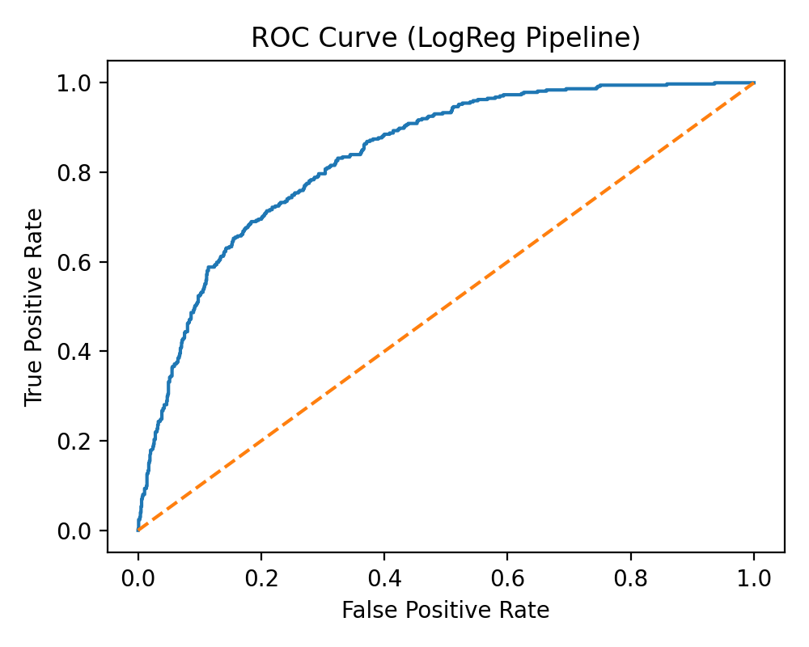
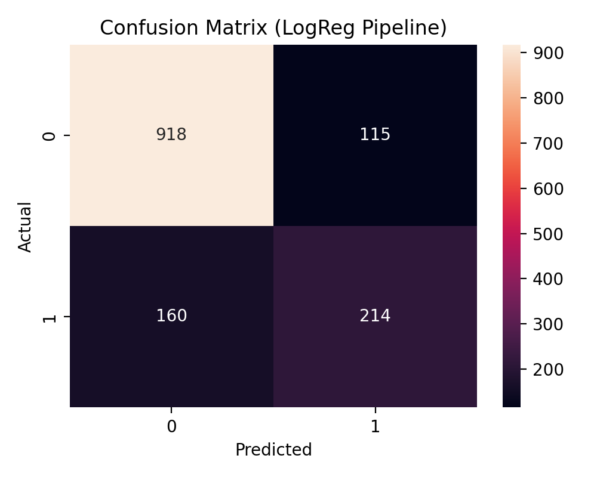
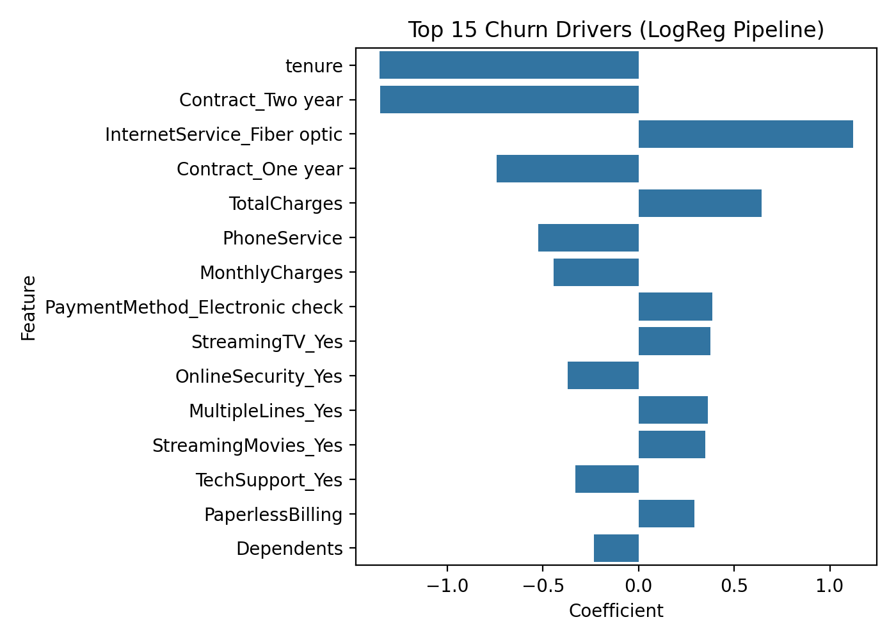

# Customer Churn Analysis & Business Solutions (Telco)

## Executive Summary
This project analyzes telecom customer churn and translates the findings into an actionable retention strategy. It includes an end-to-end pipeline (data cleaning → EDA → leakage-safe churn scoring model) and a business layer (risk tiers, retention playbooks, and ROI scenarios).

**Core result:** churn is strongly associated with **month-to-month contracts**, **fiber optic internet**, **electronic check payments**, and **low tenure**.

---

## Business Problem
Customer churn reduces recurring revenue and increases acquisition cost. The goal is to:
1) identify churn drivers,
2) predict churn risk at the customer level,
3) propose practical actions that reduce churn and estimate the financial impact.

---

## Dataset
- Source: Telco Customer Churn dataset (CSV)
- Rows: 7,043 (after cleaning: ~7,032)
- Target: `Churn` (Yes/No → 1/0)

---

## Repository Structure
- `data/raw/` raw dataset (local)
- `data/processed/` cleaned datasets and outputs
- `notebooks/` notebooks for cleaning, EDA, modeling, business layer
- `models/` trained model artifacts
- `reports/figures/` exported charts used in this README
- `sql/` SQL segmentation scripts (optional extension)

---

## Method Overview
### 1) Data Cleaning
Key steps:
- fixed `TotalCharges` type issues and removed invalid rows
- encoded binary variables and preserved multi-class categoricals for pipeline encoding

Output: `data/processed/telco_churn_clean.csv`

### 2) Exploratory Data Analysis (EDA)
EDA focuses on churn drivers and segment behavior:
- churn by contract type
- churn by internet service type
- churn by payment method
- numeric patterns (tenure, monthly charges, total charges)

### 3) Leakage-Safe Baseline Model (Logistic Regression)
A leakage-safe pipeline was used:
- split train/test first
- scale numeric features (train-fitted only)
- one-hot encode categoricals with `handle_unknown="ignore"` (train-fitted only)

Model output:
- churn probability (`Churn_Prob`) per customer
- coefficients used as interpretable churn drivers

---

## Key Findings (EDA + Model Drivers)
### High-risk segments
- **Month-to-month** customers churn dramatically more than 1–2 year contracts.
- **Fiber optic** customers have substantially higher churn.
- **Electronic check** users churn the most among payment types.
- **Low tenure** is the strongest churn signal.

### Model performance (baseline)
The logistic regression pipeline provides an interpretable baseline for churn scoring.

**Artifacts**
- ROC curve: `reports/figures/roc_curve_logreg_pipeline.png`
- Confusion matrix: `reports/figures/confusion_matrix_logreg_pipeline.png`
- Drivers: `reports/figures/top15_coefficients_logreg_pipeline.png`





Metrics are saved in: `data/processed/logreg_pipeline_metrics.csv`

---

## Business Strategy (What to do with the scores)
### Risk Tiering
Customers are grouped by predicted churn probability:
- **High risk**: immediate outreach
- **Medium risk**: targeted nudges and plan optimization
- **Low risk**: loyalty reinforcement and referral

Output: `data/processed/churn_scores_with_risk_tiers.csv`

### Retention Playbooks
Example actions:
- **High risk**: contract upgrade incentives, priority support, bundle offers
- **Medium risk**: plan optimization, payment method switch incentives
- **Low risk**: referral program, loyalty benefits

Output: `data/processed/retention_playbooks.csv`

---

## Financial Impact (ROI Scenarios)
A simple ROI model estimates the value of reducing churn among high-risk customers using explicit assumptions.

Output: `data/processed/roi_scenarios.csv`

---

## How to Run
```bash
python3 -m venv venv
source venv/bin/activate
pip install -r requirements.txt
jupyter notebook

Recommended notebook order:

notebooks/01_data_ingest_and_cleaning.ipynb

notebooks/02_eda.ipynb

notebooks/03_model_logreg_pipeline.ipynb

notebooks/04_business_insights_and_actions.ipynb

## Decision Dashboard (Market Research & Business View)

This dashboard reframes churn from a modeling output into a decision tool: where churn risk concentrates, where revenue is at risk, and which levers (contract, service, payment) dominate high-risk segments.

### 1) Expected revenue at risk by churn tier


### 2) Risk × Value matrix (prioritization view)


### 3) High-risk segment driver breakdown

