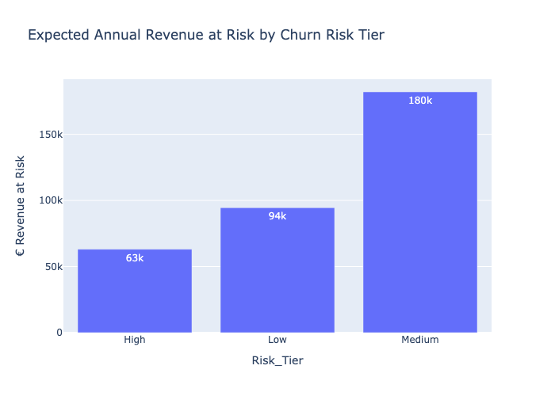
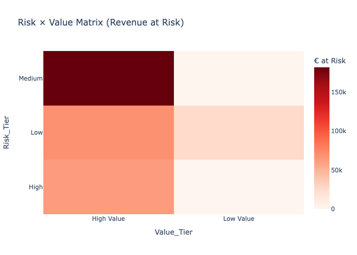
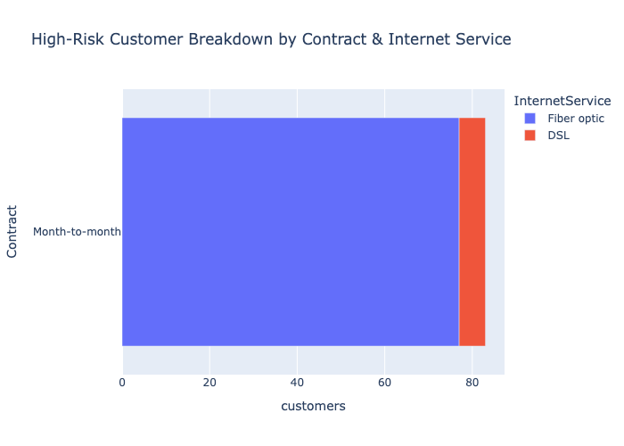

# Customer Churn and Revenue-at-Risk Analysis

**Portfolio case study | Customer analytics, retention strategy and business decision support**

## Executive Summary

This project analyzes customer churn in a telecommunications company and converts the results into a practical retention strategy.

The analysis covers 7,043 customer records and examines how churn differs across contract type, customer tenure, internet service and payment method. A customer risk-scoring approach is then used to prioritize customers according to both churn risk and commercial value.

The main findings indicate that churn is particularly concentrated among:

* customers with month-to-month contracts;
* customers with short tenure;
* fiber-optic internet customers;
* customers using electronic-check payments.

The final output is a decision framework that helps a retention team identify which customer groups require immediate attention and which interventions should be tested.

---

## Business Problem

Customer churn reduces recurring revenue and forces companies to spend more on replacing lost customers.

The central business question is:

> Which customer groups should the company prioritize for retention, and what actions could reduce the revenue exposed to churn?

The project addresses four supporting questions:

1. Which customer characteristics are most strongly associated with churn?
2. Which customer segments show the highest churn exposure?
3. Which high-risk customers also represent high commercial value?
4. Which retention actions should be tested for each priority segment?

---

## Dataset

The project uses a public telecommunications customer-churn dataset containing 7,043 customer records.

The dataset includes:

* customer demographics;
* account tenure;
* subscribed services;
* contract type;
* payment method;
* monthly charges;
* total charges;
* customer churn status.

After resolving invalid values in `TotalCharges`, approximately 7,032 valid customer records remained for analysis.

---

## Analytical Approach

The project follows five stages:

1. Review and prepare the customer data.
2. Analyze churn patterns across major customer characteristics.
3. Estimate customer-level churn risk.
4. combine churn risk with customer value.
5. Translate the results into retention priorities and actions.

The risk score is used as a decision-support tool. The purpose is not only to predict churn, but to help determine where retention resources should be allocated.

---

## Key Findings

### 1. Contract type is a major churn indicator

Customers with month-to-month contracts show substantially higher churn than customers with one-year or two-year contracts.

**Business interpretation:**
Customers with little contractual commitment can leave more easily and may require stronger incentives to remain.

### 2. Newer customers are more vulnerable

Customers with short tenure show a higher likelihood of churn.

**Business interpretation:**
The early customer experience appears to be an important retention period. Weak onboarding or unmet expectations may cause customers to leave before establishing a long-term relationship.

### 3. Fiber-optic customers show elevated churn

Fiber-optic customers demonstrate higher churn than several other service groups.

**Business interpretation:**
The result may reflect pricing, service quality, customer expectations or another factor not directly observed in the dataset. Further investigation is required before selecting an intervention.

### 4. Electronic-check customers show higher churn

Customers paying by electronic check have a higher observed churn rate than customers using several other payment methods.

**Business interpretation:**
Payment experience or customer characteristics connected to this payment method may influence retention.

---

## Decision Views

### Revenue exposed by risk tier

This view estimates where expected customer revenue is concentrated across the churn-risk groups.



### Risk and customer-value matrix

This matrix separates customers according to both their estimated churn risk and their commercial value.

High-risk, high-value customers represent the strongest immediate retention priority.



### High-risk segment characteristics

This view shows which contract, service and payment characteristics occur most frequently within the high-risk customer group.



---

## Recommended Retention Actions

| Finding                                     | Recommended action                                                        | Measurement                                   |
| ------------------------------------------- | ------------------------------------------------------------------------- | --------------------------------------------- |
| High churn among month-to-month customers   | Test incentives for moving selected customers to longer contracts         | Contract conversion rate and subsequent churn |
| High churn among newer customers            | Introduce an early-tenure onboarding and support programme                | 30-, 60- and 90-day churn                     |
| Elevated churn among electronic-check users | Test incentives for moving customers to automatic payment                 | Payment-method conversion and churn           |
| High-risk, high-value customers             | Prioritize personalized retention contact before broad discount campaigns | Retention rate, saved revenue and offer cost  |
| Elevated churn among fiber-optic customers  | Investigate service complaints, pricing and customer expectations         | Churn by service issue and satisfaction level |

These actions are proposed as experiments. The available data shows associations, but it does not prove that any individual characteristic directly causes churn.

---

## Customer Prioritization Framework

Customers are grouped into three risk levels:

* **High risk:** immediate review and prioritized retention contact;
* **Medium risk:** targeted communication, plan review and relevant service offers;
* **Low risk:** loyalty reinforcement, referral activity and normal monitoring.

Risk level should not be used alone. Customer value, expected revenue exposure, intervention cost and the likelihood of successful retention should also influence the final decision.

---

## Tools and Skills Demonstrated

* Python
* Jupyter Notebook
* data preparation
* exploratory data analysis
* customer segmentation
* customer risk scoring
* data visualization
* revenue-at-risk analysis
* business recommendation development
* analytical communication

---

## Repository Structure

```text
telco-churn-analytics/
│
├── notebooks/
│   ├── 03_model_logreg_pipeline.ipynb
│   ├── 04_business_insights_and_actions.ipynb
│   └── 05_dashboard_decision_views.ipynb
│
├── reports/
│   └── figures/
│       ├── confusion_matrix_logreg_pipeline.png
│       ├── high_risk_driver_breakdown.png
│       ├── revenue_at_risk_by_tier.png
│       ├── risk_value_matrix.png
│       ├── roc_curve_logreg_pipeline.png
│       └── top15_coefficients_logreg_pipeline.png
│
└── README.md
```

---

## Assumptions and Limitations

* The project uses a public dataset rather than operational company data.
* The data represents a snapshot and does not provide a complete customer-behaviour timeline.
* The analysis identifies relationships between customer characteristics and churn, not proven causal effects.
* The dataset does not contain complete information about customer complaints, service quality, competitor offers or previous retention contacts.
* Revenue-at-risk calculations depend on simplified assumptions and should not be interpreted as audited financial forecasts.
* Customer risk scores would require monitoring and validation before operational use.
* Recommended retention actions have not been tested through controlled experiments.

---

## Future Development

The next stages of the project are:

1. reproduce the main customer and churn analysis using SQL;
2. create an interactive Power BI decision dashboard;
3. add documented financial assumptions to the revenue-at-risk calculations;
4. add the complete data-preparation workflow and reproducibility files.

---

## Project Positioning

This is an independent portfolio case study created to demonstrate how customer data can be transformed into business findings, prioritization logic and practical retention recommendations.
